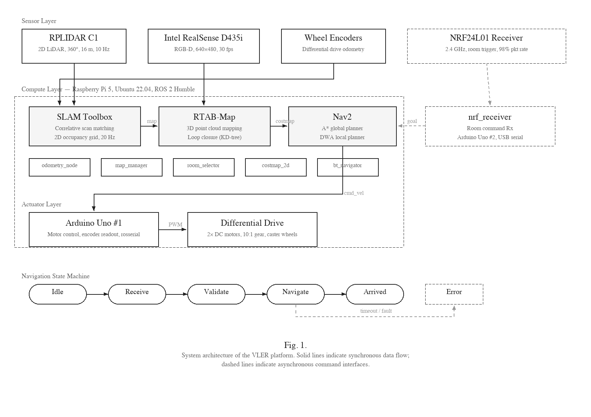

# VLER — Visual + LiDAR Exploration Robot

Autonomous indoor delivery robot for hospital environments. Staff press a button at any room, and the robot navigates there autonomously — mapping with RPLIDAR + Intel RealSense, localizing via SLAM Toolbox, and avoiding dynamic obstacles in real time.

Built for the Advanced Mechatronics course (ROB-GY 6103) at NYU.

## System Architecture

  

## Hardware

| Component | Model | Purpose |
|-----------|-------|---------|
| Compute | Raspberry Pi 5 | Main processor — SLAM, Nav2, ROS nodes |
| 2D LiDAR | RPLIDAR C1 | 360° scan, 16m range — occupancy grid mapping |
| Depth Camera | Intel RealSense D435i | 3D point cloud, overhang detection |
| Motor Controller | Arduino Uno #1 | Wheel encoder odometry via rosserial |
| Wireless Rx | Arduino Uno #2 | NRF24L01 receiver — room ID commands |
| Drive | Differential-drive | Two encoder-equipped DC motors + caster wheels |
| Comms | NRF24L01 (2.4 GHz) | Wireless room-trigger buttons — 98% packet success |

## How It Works

**Mapping (SLAM Toolbox)**
1. LiDAR scans matched to submaps using correlative scan matching with encoder odometry
2. New 5×5m submaps spawned every 2m with 50% overlap
3. Loop closures detected every 30s via KD-tree lookup — pose-graph optimization corrects drift
4. Maps saved and loaded for localization-only mode at 20 Hz

**Navigation (Nav2)**
- Global planner: A* on occupancy grid
- Local planner: DWA with velocity sampling and footprint constraints
- Obstacle avoidance: LiDAR-driven local costmap detects dynamic obstacles (people, carts)

**Wireless Command Interface**
- Each room has an Arduino + NRF24L01 button — press to summon the robot
- State machine: `Idle → Receive → Validate → Navigate → Arrived`
- 98% packet reception, sub-100ms end-to-end latency

## SLAM Parameter Tuning

| Parameter | Value | Reason |
|-----------|-------|--------|
| `max_range` | 16m | Discard unreliable long-range returns |
| `min_range` | 0.1m | Ignore base reflections |
| `angle_increment` | 0.5° | 720 points/rev at 10 Hz |
| `voxel_filter_size` | 0.05m | Point-cloud downsampling for RTAB-Map |
| `scan_matcher` weights | Translation 40.0, Rotation 20.0 | Favor consistent position in straight corridors |

## Results

| Metric | Result |
|--------|--------|
| Mapping success rate | 100% |
| Obstacle avoidance | Real-time detection and avoidance |
| Wireless trigger reliability | 98% packet reception, 50ms latency |
| Manual traversal | Successful |
| Autonomous path planning | TF/timestamp issues prevented end-to-end (see Known Issues) |

## Known Issues

- **Global planner TF mismatch** — Frame-transform and timestamp inconsistencies between `map`, `odom`, and `base_link` prevented autonomous waypoint navigation
- **Motor serialization bug** — Velocity commands were correctly formed but ignored by motor controller due to serialization errors
- **No EKF/IMU fusion** — Wheel-only odometry drifts on smooth hospital floors

## Future Work

- Resolve TF frame issues for end-to-end autonomous navigation
- Integrate IMU via EKF for tighter odometry fusion
- Multi-floor mapping with RTAB-Map 3D + elevator handling
- Fuse depth-camera point clouds into Nav2 costmap for overhang detection

## Stack

`ROS 2 Humble` · `SLAM Toolbox` · `RTAB-Map` · `Nav2` · `RPLIDAR C1` · `Intel RealSense D435i` · `Raspberry Pi 5` · `Arduino Uno` · `NRF24L01` · `Python` · `C++`

## Team

Tarunkumar Palanivelan · Abirami · Sven Sunny Kottuppallil
